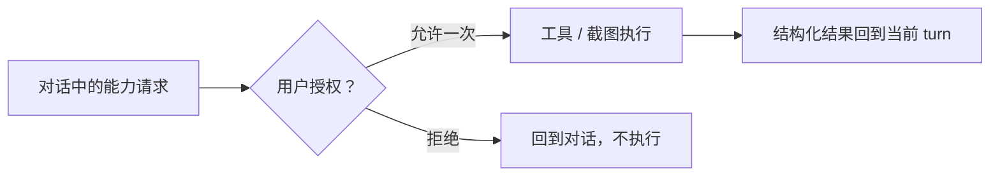

# 工具与感知

> 让 momo 在你允许的范围内理解屏幕、调用工具，并把结果带回当前对话。

```mermaid
flowchart LR
    REQUEST["对话中的能力请求"] --> PERMISSION{"用户授权？"}
    PERMISSION -->|"允许一次"| TOOL["工具 / 截图执行"]
    PERMISSION -->|"拒绝"| DENY["回到对话，不执行"]
    TOOL --> RESULT["结构化结果回到当前 turn"]
```

详细权限路径见 [受控扩展](./dialogue.md) 与 [用户操作路径图谱](../01-architecture/workflows.md)。工具/action 使用独立扩展消息组。
