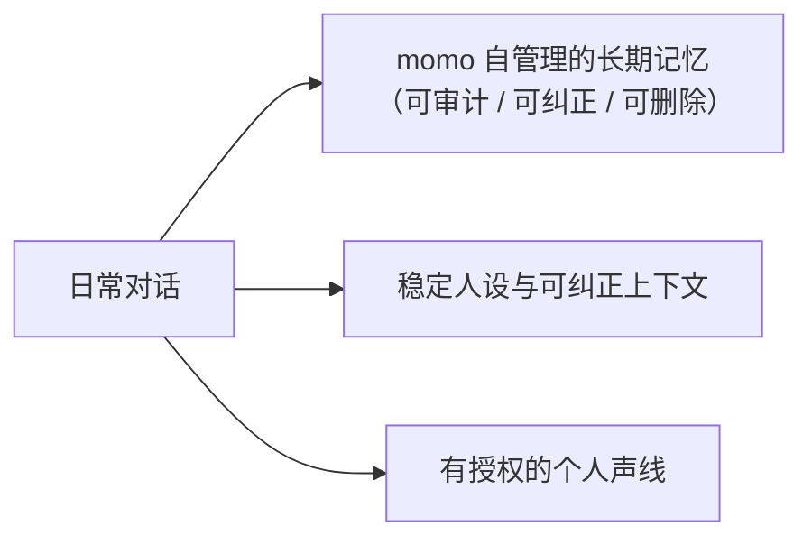

# 记忆与人格

> 相处留下的线索，成为下一次交流的上下文。

```mermaid
flowchart LR
    CHAT["日常对话"] --> MEMORY["momo 自管理的长期记忆<br/>（可审计 / 可纠正 / 可删除）"]
    CHAT --> PERSONA["稳定人设与可纠正上下文"]
    CHAT --> VOICE["有授权的个人声线"]
```

- [长期记忆实装（ADR-014）](./memory.md)
- [像人深化](./stage.md)
- [人格与可纠正上下文](../04-tracks/persona.md)
- [操作路径图谱](../01-architecture/workflows.md)
