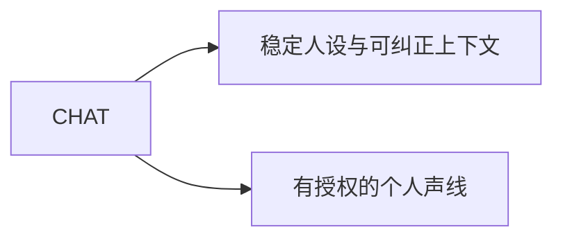

# 记忆与人格

> 相处留下的线索，成为下一次交流的上下文。

```mermaid
flowchart LR
    CHAT --> PERSONA["稳定人设与可纠正上下文"]
    CHAT --> VOICE["有授权的个人声线"]
```

- [人格与可纠正上下文](../04-tracks/persona.md)
- [操作路径图谱](../01-architecture/workflows.md)
