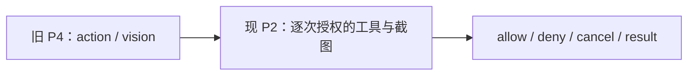

# 兼容页：旧 P4「能力」

> 旧 phase 编号已退休。本路径保留以免旧链接失效。

```mermaid
flowchart LR
    OLD["旧 P4：action / vision"] --> P2["现 P2：逐次授权的工具与截图"]
    P2 --> FLOW["allow / deny / cancel / result"]
```

当前权威范围见 [P2 受控扩展](./p2-dialogue.md) 与 [用户操作路径图谱](../01-architecture/workflows.md)。工具/action 协议属于 v2 extension group，不是 P0 实现。
